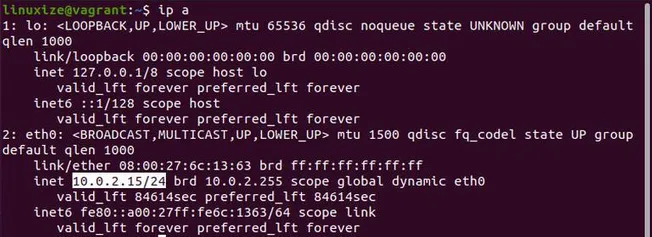

# Install SSH in Ubuntu

#### Step 1: Open the terminal with Ctrl+Alt+T and install the openssh-server package:
```
sudo apt update
sudo apt install openssh-server
```

#### Step 2: Once the installation is complete, the SSH service will start automatically. You can verify that SSH is running by typing:
```
sudo systemctl status ssh
```
##### The output should tell you that the service is running and enabled to start on system boot:
```
ssh.service - OpenBSD Secure Shell server
    Loaded: loaded (/lib/systemd/system/ssh.service; enabled; vendor preset: enabled)
    Active: active (running) since Mon 2020-06-01 12:34:00 CEST; 9h ago
...

Press q to get back to the command line prompt.
```
#### Step 3: Ubuntu ships with a firewall configuration tool called UFW. If the firewall is enabled on your system, make sure to open the SSH port:

```
sudo ufw allow ssh


That’s it! You can now connect to your Ubuntu system via SSH from any remote machine. Linux and macOS systems have SSH clients installed by default. To connect from a Windows machine, use an SSH client such as PuTTY .
```

#### Step 4: Connecting to the SSH Server

```
ssh username@ip_address
```

#### If you don’t know your IP address you can easily find it using the ip command :

```
ip a
```


---

##### As you can see from the output, the system IP address is 10.0.2.15.

##### 
```
ssh linuxize@10.0.2.15
```

##### type yes and enter

```
icity of host '10.0.2.15 (10.0.2.15)' can't be established.
ECDSA key fingerprint is SHA256:Vybt22mVXuNuB5unE++yowF7lgA/9/2bLSiO3qmYWBY.
Are you sure you want to continue connecting (yes/no)?
```

#### Enter Password
```
Warning: Permanently added '10.0.2.15' (ECDSA) to the list of known hosts.
linuxize@10.0.2.15's password:
```

#### Output
```Welcome to Ubuntu 20.04 LTS (GNU/Linux 5.4.0-26-generic x86_64)

 * Documentation:  https://help.ubuntu.com
 * Management:     https://landscape.canonical.com
 * Support:        https://ubuntu.com/advantage
...
```

#### Connecting to SSH behind NAT 
```
To connect to your home Ubuntu machine over the Internet you will need to know your public IP Address and to configure your router to accept data on port 22 and send it to the Ubuntu system where the SSH is running.

To determine the public IP address of the machine you’re trying to SSH to, simply visit the following URL: https://api.ipify.org .


When it comes to setting up port forwarding , each router has a different way to setup port forwarding. You should consult your router documentation about how to set up port forwarding. In short, you need to enter the port number where requests will be made (Default SSH port is 22) and the private IP address you found earlier (using the ip a command) of the machine where the SSH is running.
```

#### Once you’ve found the IP address, and configured your router you can log in by typing:

```
ssh username@public_ip_address
```

```
If you are exposing your machine to the Internet it is a good idea to implement some security measures. The most basic one is to configure your router to accept SSH traffic on a non-standard port and to forward it to port 22 on the machine running the SSH service.

You can also set up an SSH key-based authentication and connect to your Ubuntu machine without entering a password
```
#### Disabling SSH on Ubuntu 
```
sudo systemctl disable --now ssh
```
#### Later, to re-enable it, type:
```
sudo systemctl enable --now ssh
```

